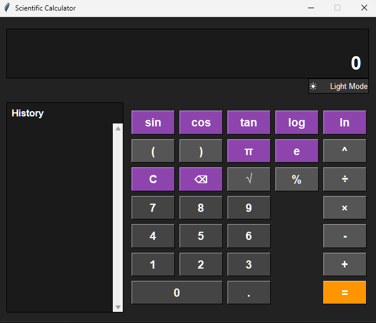
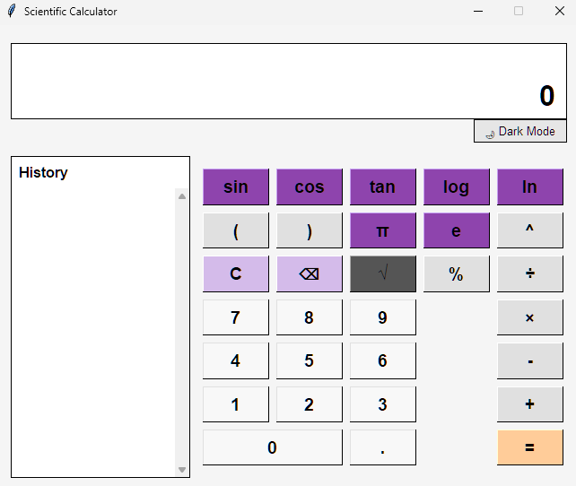
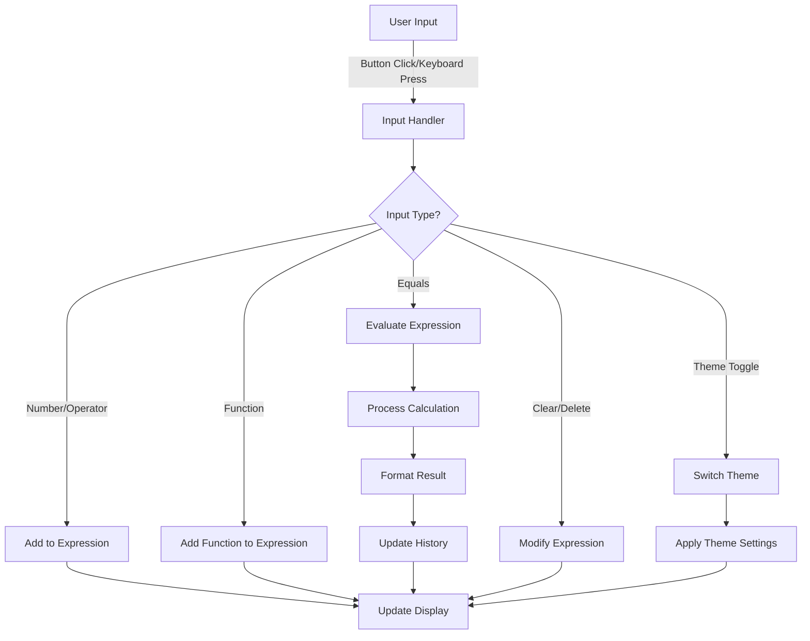

# Scientific Calculator with History Log and Theme Toggle

## Project Description
This project is a full-featured scientific calculator built with Python and Tkinter. It provides both basic arithmetic operations and advanced scientific functions with an elegant user interface that includes a history log and dark/light mode toggle.

## Table of Contents
1. [Introduction](#introduction)
2. [Features](#features)
3. [Technologies Used](#technologies-used)
4. [Installation](#installation)
5. [Usage](#usage)
6. [Screenshots](#screenshots)
7. [Implementation Details](#implementation-details)
8. [Workflow Diagram](#workflow-diagram)
9. [Future Work](#future-work)
10. [Contributing](#contributing)
11. [License](#license)

## Introduction
This calculator application was designed to provide a comprehensive yet user-friendly tool for performing mathematical calculations. It combines the simplicity of a basic calculator with the power of scientific functions, all wrapped in a modern and customizable interface.

## Features
- Basic arithmetic operations (addition, subtraction, multiplication, division)
- Scientific functions (sin, cos, tan, log, ln, square root, powers)
- Mathematical constants (π, e)
- Interactive history log that records all calculations
- Dark/Light theme toggle for user preference
- Clean and responsive user interface
- Error handling for invalid expressions
- Keyboard input support for efficient calculations

## Technologies Used
- Python 3.13
- Tkinter (GUI library)
- Math module for scientific operations
- Object-Oriented Programming principles

## Installation
To run this calculator application, ensure you have Python installed on your system:

```bash
# Clone the repository (if applicable)
git clone https://github.com/0xarchit/scientific-calculator.git

# Navigate to the project directory
cd scientific-calculator

# Run the application
python main.py
```

No additional dependencies are required as Tkinter is included in standard Python installations.

## Usage
1. **Basic Operations**: Click on the digit buttons and operators to build expressions
2. **Scientific Functions**: Use sin, cos, tan, log, etc. for advanced calculations
3. **History**: Review past calculations in the history panel on the left
4. **Theme Toggle**: Switch between dark and light modes using the toggle button
5. **Clear/Delete**: Use 'C' to clear the current expression or '⌫' to delete the last character
6. **Keyboard Input**: Use your keyboard for faster input:
   - Number keys (0-9) for digits
   - Standard operators (+, -, *, /)
   - Enter key to evaluate expressions
   - Backspace to delete last character
   - Escape key to clear the expression
   - Keyboard shortcuts for functions: 's' for sin, 'c' for cos, etc.

### Example Operations:
- Basic arithmetic: `5 + 7 = 12`
- Using constants: `2 × π = 6.283185307179586`
- Scientific functions: `sin(π/2) = 1.0`
- Combined operations: `3 × (4 + 5) = 27`

## Screenshots



## Implementation Details
The calculator is implemented using object-oriented programming with the following key components:

- **Main Application Class**: Manages the overall application state and UI
- **Display System**: Shows the current expression and calculation results
- **Button Grid**: Organized layout for digits, operators, and functions
- **Calculation Engine**: Evaluates mathematical expressions safely
- **History System**: Records and displays calculation history
- **Theme Manager**: Handles switching between dark and light color schemes
- **Keyboard Handler**: Processes keyboard events for direct input

## Workflow Diagram

Below is a diagram illustrating the workflow of the calculator application:



## Future Work
- Add memory functions (M+, M-, MR, MC)
- Implement unit conversion capabilities
- Support for more complex mathematical functions
- Ability to save calculation history to a file
- Add scientific notation support
- Implement bracket matching and syntax highlighting
- Create a mobile-friendly responsive design

## Contributing
Contributions to improve the calculator are welcome. Please follow these steps:

1. Fork the repository
2. Create a new branch (`git checkout -b feature-branch`)
3. Make your changes
4. Commit your changes (`git commit -m 'Add new feature'`)
5. Push to the branch (`git push origin feature-branch`)
6. Open a Pull Request

## License
This project is licensed under the MIT License - see the LICENSE file for details.